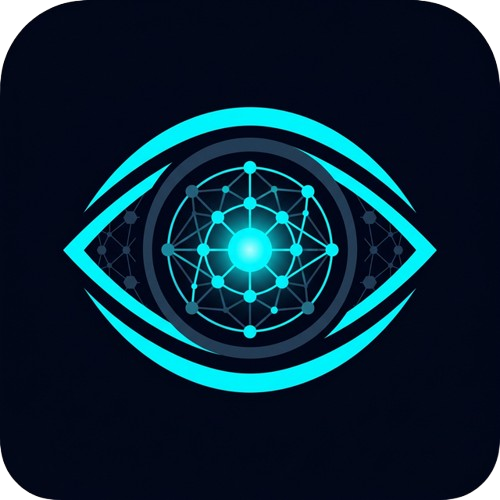

<div align="center">
  
  <h1>EyeVLM</h1>
  <p><strong>AI-powered Early Eye Disease Screening Application</strong></p>
  
  [](https://github.com/AsmSafone/EyeVLM/actions/workflows/android-build.yml)
  [](https://opensource.org/licenses/MIT)
  [](https://nextjs.org/)
  [](https://capacitorjs.com/)
</div>

<br />

EyeVLM is a cross-platform, progressive web application engineered to provide early detection of common eye diseases such as Cataracts, Pterygium, Conjunctivitis, Keratitis, Uveitis, and Ptosis. By leveraging Vision Language Models, EyeVLM analyzes optical disc images directly from a user's smartphone camera.

## ✨ Features
- **Mobile First Interface**: Engineered in Next.js as a fully responsive Progressive Web App with fluid framer-motion animations.
- **Native Android APK Integration**: Seamless wrapper utilizing Capacitor v8, including native Android hardware API plugins (`capacitor-camera-view`).
- **Precision Viewfinder & Zoom**: A highly customized camera stream tracker that dynamically controls device hardware (including optical/digital zoom capabilities), pre-crops live video feeds instantly using HTML5 Canvas mathematical coordinate injection, and leverages `react-cropper` to isolate purely the optical disc focus.
- **Robust Multi-Language System**: Full internal support via Context API translation strings (English & Bengali supported out-of-the-box).
- **Over The Air Updating**: Integrated blocking UI client prompt that intercepts older APK clients by querying the Github action pipelines to require forced application updates. Next.js natively builds dynamic valid `versionCode` variables directly into `<Project>/android/app/build.gradle`.
- **Hardware Native Navigation**: Dynamic handling of Android hardware back buttons using `@capacitor/app` wrapper injected over `<RootLayout>`, alongside safety-exit hooks powered by `@capacitor/toast`.

## 🚀 Workflows
### Android APK Generation
This repository maintains a fully customized GitHub Actions CI/CD pipeline!

- Push any code to `main` (except `README`/Environment vars) to automatically assemble and test the debug APKs ensuring branch integrity.
- **Publishing Releases**: Simply modify `package.json` to bump the `<version>` string. The GitHub Action will detect a new unseen version, extract the string using Node, and automatically generate and deploy an official Tagged APK Release file utilizing `softprops/action-gh-release`!

## 💻 Tech Stack
- **Frontend Framework**: Next.js 15 (App Router), React 19
- **Design System**: Tailwind CSS v4, Lucide React Icons
- **Native Wrapper**: Capacitor v8
- **Device Hardware**: `navigator.mediaDevices.getUserMedia`, `capacitor-camera-view`
- **Dependencies**: `react-cropper`, `framer-motion`, `@capacitor/app`

## 📦 Local Installation

To run this application locally on your machine, follow these steps:

### Prerequisites:
- `Node.js >= 22`
- `npm`

1. Clone the repository
```bash
git clone https://github.com/AsmSafone/EyeVLM.git
```
2. Navigate into the directory and install dependencies
```bash
cd EyeVLM
npm install
```
3. Start the Next.js development server
```bash
npm run dev
```

### Compiling to Android (Locally)
If you wish to test the application logic wrapped inside the local device APK rather than a browser emulator:
```bash
npm run build
npx cap sync android
```
Open Android Studio, point it to the `/EyeVLM/android` directory, run a Gradle sync, and Play!

## 📜 License
This project is licensed under the MIT License - see the [LICENSE](LICENSE) file for details.
